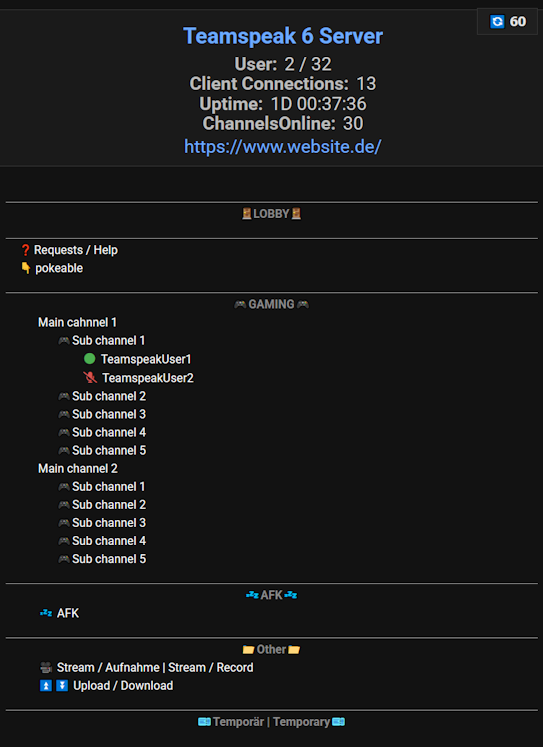
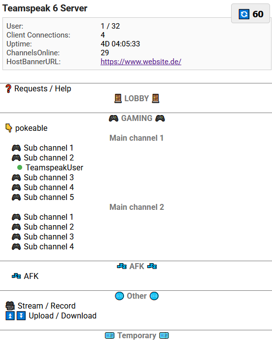

# TS6 Viewer
<p align="center">
  
  
</p>

A lightweight, fast, and modern web viewer for **TeamSpeak 6** servers.  
TS6 Viewer connects to the TeamSpeak 6 WebQuery API, retrieves live server and channel data, and displays it in a clean, responsive web interface with optional dark/light themes.

The viewer is designed to be:

- Simple to deploy  
- Fast and lightweight  
- Fully client‑side auto‑refreshing  
- Compatible with any TS6 server exposing WebQuery  
- Customizable via a single `config.json` file  

---

## Features

- Live TeamSpeak 6 server viewer  
- Auto‑refresh with configurable interval  
- Dark and light themes  
- Channel tree rendering with clients  
- Spacer and full‑width channel support  
- Caching + rate‑limit protection  
- Works on Windows, Linux, and Docker‑friendly environments  

---

## Configuration

The application uses a `config.json` file located in the same directory as the executable.

### Example `config.json`

```json
{
  "_comment": "TS6 Viewer Configuration File",
  "_comment2": "Rename this file to config.json and adjust the values to your setup.",

  "server_port": "8080",
  "_comment_server_port": "The port on which the TS6 Viewer web interface will be available.",

  "theme": "dark",
  "_comment_theme": "Choose between 'light' or 'dark' for the viewer theme.",

  "refresh_interval": 60,
  "_comment_refresh_interval": "How often the viewer should auto-refresh (in seconds).",

  "teamspeak6": {
    "base_url": "http://192.168.178.195:57007",
    "_comment_base_url": "The WebQuery HTTP endpoint of your TeamSpeak 6 server. Usually http://<ip>:10080 or your mapped port.",

    "api_key": "geheim",
    "_comment_api_key": "Your TeamSpeak 6 ServerQuery API key. It is shown ONCE in the server logs on first startup. If lost, create a new one.",

    "server_id": 1,
    "_comment_server_id": "The ID of the virtual server you want to display. Default is usually 1."
  }
}
```

---

## Building the Program

The project is written in **Go**, so building is extremely simple.

### Prerequisites

- Go 1.20 or newer  
- Git (optional)

---

## Build on Linux
```bash
git clone https://github.com/Maxallica/ts6-viewer.git
cd ts6viewer

go build -o ts6viewer
```

## Build Windows binary on Linux
```bash
cd "*/ts6-viewer/cmd/server"

GOOS=windows GOARCH=amd64 go build -o ts6viewer.exe
```

## Running on Linux
```bash
./ts6viewer
```

## Build on Windows
```bash
git clone https://github.com/Maxallica/ts6-viewer.git
cd ts6viewer

go build -o ts6viewer.exe
```

## Build Linux binary on Windows
```bash
cd "*/ts6-viewer/cmd/server"

$env:GOOS="linux"
$env:GOARCH="amd64"
go build -o ts6viewer
```

## Running on Windows
```bash
.\ts6viewer.exe
```

---

## Navigate to the ts6viewer page
http(s)\://\<ip\>:\<port\>/ts6viewer

---

## ❤️ Made with love in Germany