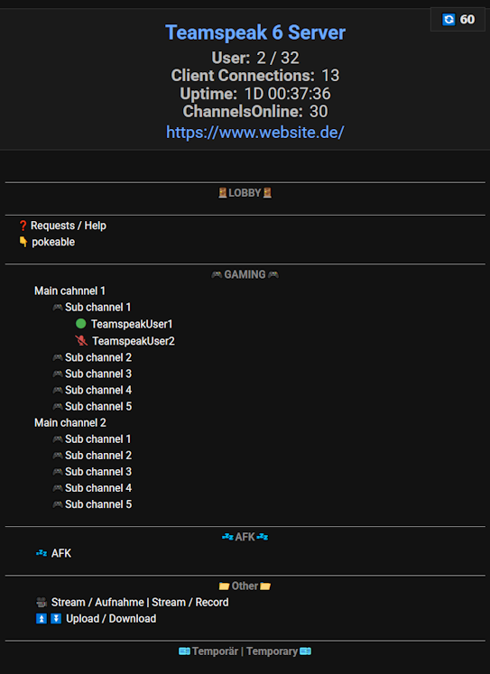
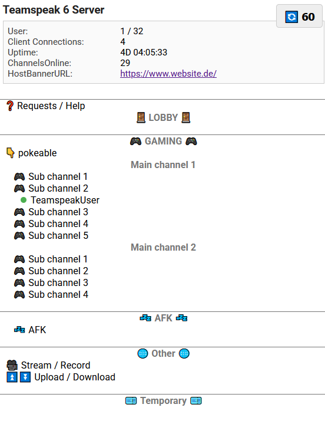

TS6 Viewer
<p align="center">
  
  
</p>

A lightweight, fast, and modern web viewer for **TeamSpeak 6** servers.  
TS6 Viewer connects to **ServerQuery (SSH, Port 10022)** and displays live server, channel, and client information.

The viewer is designed to be:

- Simple to deploy  
- Fast and lightweight  
- Fully client‑side auto‑refreshing  
- Compatible with any TS6 server  
- Customizable via a single `config.json` file  

---


## Features

- Live TeamSpeak 6 server viewer  
- Auto‑refresh with configurable interval  
- Dark and light themes  
- Channel tree rendering with clients  
- Spacer and full‑width channel support  
- Caching + rate‑limit protection  
- Pure **ServerQuery (SSH)** backend  
- Optional **voice status** (mute status, audio status, talking)  

---

# ServerQuery (SSH)

TS6 Viewer communicates exclusively via ServerQuery over SSH.

Advantages:
- Persistent SSH connection
- Very fast, even with many clients
- clientlist -voice provides all audio/mute/talker info in a single call
- No REST overhead
- No per-client requests
- No rate limits

---

# Configuration Files in the Project

The repository includes two important configuration templates:

### `config.example.json`
This file is included in the project and serves as the template for your actual configuration.  
You can:

- rename it manually to `config.json`, or  
- let Docker generate `config.json` automatically using environment variables.

---

# Docker Support

This repository includes:
- Dockerfile.sh — multi‑stage build for Go + Alpine
- entrypoint.sh — generates config.json dynamically using environment variables
- compose.yml — ready to run the viewer with one command

This allows you to run TS6 Viewer fully containerized.

---

## Dockerfile.sh explained

The Dockerfile uses two stages:

### 1) Builder Stage
- Based on golang:1.20-alpine
- Copies the entire repository into /app
- Ensures config.example.json exists
- Normalizes go.mod to avoid Go version parsing issues
- Builds a static Linux binary: cmd/server/ts6viewer

### 2) Runtime Stage
- Based on alpine:latest
- Installs CA certificates + gettext (envsubst)
- Copies the built binary and assets from the builder
- Copies entrypoint.sh
- Exposes port 8080
- Starts the viewer via the entrypoint script

---

## entrypoint.sh explained

The entrypoint script:

1. Loads environment variables
2. Applies defaults if variables are missing
3. Uses envsubst to generate config.json from config.example.json
4. Starts the TS6 Viewer binary

Environment variables include:

- SERVER_PORT
- THEME
- REFRESH_INTERVAL
- HOST
- PORT
- USER
- PASSWORD
- ENABLE_VOICE_STATUS
- SERVER_ID

This makes the Docker container fully configurable without editing files.

# compose.yml

The `compose.yml` file provides a straightforward example of how to configure and run the ts6viewer using Docker. It also shows how to switch between a locally built image and the official Docker Hub image:

```
# Use this if you built the image locally via:
# docker build -t ts6viewer:main .
# image: ts6viewer:main
# Use this if you want to pull the prebuilt image from Docker Hub
image: maxallica/ts6-viewer:latest
```

You can find the prebuilt Docker image here
[](https://hub.docker.com/r/maxallica/ts6-viewer)

---


# Building the Program

The project is written in Go.

### Build on Linux

```sh
git clone https://github.com/Maxallica/ts6-viewer.git
cd ts6viewer
go build -o ts6viewer
```

### Build Windows binary on Linux
```sh
cd "*/ts6-viewer/cmd/server"
GOOS=windows GOARCH=amd64 go build -o ts6viewer.exe
```

### Running on Linux

```sh
./ts6viewer
```

### Build on Windows

```sh
git clone https://github.com/Maxallica/ts6-viewer.git
cd ts6viewer
go build -o ts6viewer.exe
```

### Build Linux binary on Windows

```sh
cd "*/ts6-viewer/cmd/server"
$env:GOOS="linux"
$env:GOARCH="amd64"
go build -o ts6viewer
```

### Running on Windows
```sh
.\ts6viewer.exe
```

---

## Navigate to the TS6 Viewer page

http(s)\/\/\<ip\>:\<port\>/ts6viewer

---

## ❤️ Made with love in Germany
